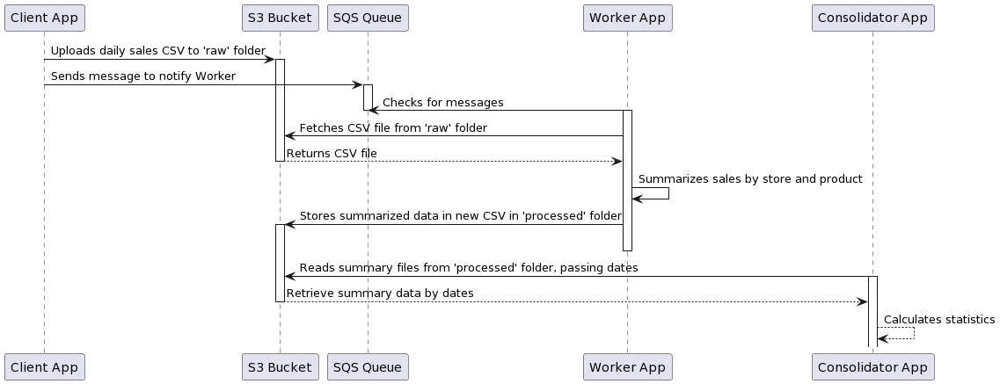
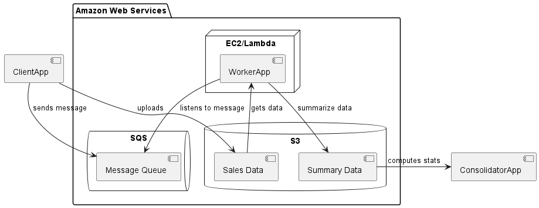

# Cloud Project Group 9

## Overview

This project is a Java application utilizing the AWS SDK to create a app-server architecture for efficient file
processing and data analysis. It integrates with various AWS services such as Amazon S3 and SQS, offering a scalable and
robust solution for handling data storage and message queueing.

This work was made by the Group 9 of the cloud computing course.

## Project

The group has been tasked with designing an AWS-based solution to consolidate daily sales data from globally distributed
stores of a large retailer. The solution is divided in three parts:
- a **Client application** used by the stores upload CSV files to Cloud storage ;
- a **Worker application** summarizes sales by store and product and stores results in Cloud storage ;
- a **Consolidator application** calculates retailer's profit and product statistics from summary files.

## Architecture

### Applications

App in the project are independent modules

#### Client Application (`client-app`)
The `ClientApp`application uploads files to Amazon S3 buckets, and sends messages to Amazon SQS queues.

#### Worker Application (`worker-app-ec2` and `worker-app-lambda`)
The `WorkerApp` application When receiving an SQS Message in `INBOX` queue, downloads sales files from S3, summarizes sales, and
uploads summary.

It summarizes the daily sales by store and by product:
- By Store : total profit,
- By Product: total quantity, total sold, total profit.

- `Sale` : Data structure of a Sale
- `SaleSummary`: Reads Sales, computes statistics for the summary, and writes SaleSummary file.

#### Consolidator Application (`consolidator-app`)
The `ConsolidatorApp` application, when receiving an SQS Message in `OUTBOX` queue, downloads summary files from S3,
analyzes them saving them locally.

It reads the summary results from the files of that date and computes: the total retailer’s profit,the most and least
profitable stores, and the total quantity, total sold, and total profit per product.

### Useful packages

#### Package `s3` to handle S3 Storage Buckets
- `S3CheckBucket`: Check if an S3 bucket exists.
- `S3CreateBucket`: Creates S3 buckets.
- `S3DownloadObject`: Downloads objects from S3.
- `S3UploadObject`: Uploads objects to S3.

#### Package `sqs` to handle SQS Queues
- `SQSCheckQueue`: Check if an SQS queue exists.
- `SQSCreateQueue`: Creates a queue.
- `SQSReceiveMessage`: Receives messages into a `List<Message>`.
- `SQSSendMessage`: Sends messages as a `List<Message>`.

## AWS Services Used

- **Amazon S3**: Used for storing and retrieving data files.
- **Amazon SQS**: Manages message queues for coordinating between different application components.
- **Amazon EC2**: Hosts the Java application worker for processing data.
- **Amazon Lambda**: Optionally used for serverless computing.

## Justification of Architecture and AWS Services

- **Amazon S3** ensures reliable and scalable storage.
- **Amazon SQS** offers a robust system for message queuing and decoupling components.
- **Amazon EC2** provides a flexible environment for running complex Java applications.
- **Amazon Lambda** offers a serverless option, reducing operational overhead.

## UML Diagrams

### Class diagram

### Sequence diagram

### Deployment diagram

## Comparison Between Lambda and Java Application Worker

### Performance
- Lambda offers quick scalability whereas EC2 provides consistent performance.

### Cost
- Lambda has a pay-per-use model, beneficial for sporadic workloads, while EC2 incurs costs based on instance uptime.

### Scalability
- Lambda scales automatically, while EC2 requires manual scaling.

### Maintainability
- Lambda functions are easier to deploy and manage compared to managing EC2 instances.

## Running the Application

1. Ensure you have correct AWS credentials see `~/.aws/`
2. Inside each module, run the .jar with `java -jar <appname>.jar <arguments>`

## Contributing

- Minh-Hoang Huynh: minh-hoang.huynh@etu.emse.fr
- Ninon Lahiani: ext.21m2017@etu.emse.fr
- Julien Séailles: julien.seailles@etu.emse.fr
- Utibeabasi Dan: dautibeabasi@gmail.com
